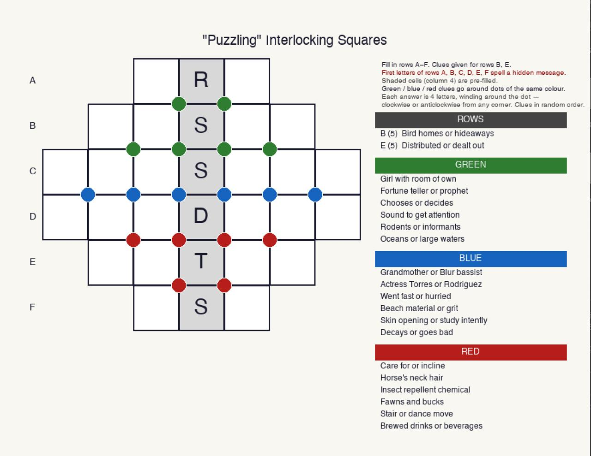

# Word Puzzle Generator

A Python toolkit for generating, filling, and cluing word puzzles. Four puzzle types, each with its own generator and worked example.

This project grew out of making personalised puzzles for friends and family — a birthday puzzle with someone's name hidden in the grid, an anniversary puzzle built around a shared memory, a puzzle that spells out a secret message. Three of the four puzzle types let you pass in a list of words you want the solver to try and include:

```bash
# A Snakes & Ladders puzzle built around an anniversary
python3 snakes_ladders/snakes_ladders.py generate --include "RENU; ARNIE; JUNE" --png puzzle.png

# An Interlocking Squares puzzle with a birthday message
python3 interlocking/interlocking.py --include "HAPPY; ARJUN; MAMA" --png puzzle.png

# A Back-and-Forth puzzle hiding two names
python3 back_and_forth/back_and_forth.py --include "ALICE:forward; BOB:backward" --png puzzle.png
```

The solver does its best to honour your words — it guarantees at least a minimum number will appear, and fills the rest automatically. The cryptic crossword doesn't have an include list (the grid is fixed before cluing), but you can steer it by choosing which fill to keep in interactive mode.

## How it works

The algorithms do the heavy lifting — they search for valid fills, check word quality, and render the puzzle images. But the clues are yours. Each puzzle type stores its content in a plain Python dict that you can edit directly, for example [`cryptic/puzzles_data.py`](cryptic/puzzles_data.py):

```python
"my_puzzle": {
    "grid": [...],
    "clues": {
        "1A": "Your clue here (5)",
        "1D": "Another clue (7)",
        ...
    }
}
```

Edit the clues, re-run the renderer, and you get updated puzzle images. No programming knowledge required beyond opening a file.

Every puzzle type is generated from the command line, for example:

```bash
python3 cryptic/filler.py --seed 401 --png mypuzzle.png
```

The exact flags vary by puzzle type — see each subdirectory's README for details.

**Claude is entirely optional.** You do not need an Anthropic API key to generate or render any puzzle. The one exception is if you want Claude to help you write cryptic crossword clues — for that, add your key to a `.env` file:

```
ANTHROPIC_API_KEY=sk-ant-...
```

---

## Puzzle types

### Back-and-Forth

A string of letters that can be cut two different ways — each cut reading left-to-right and right-to-left yields a valid word chain. The puzzle presents only the letter string; solvers must find both cuts.


→ [`back_and_forth/`](back_and_forth/README.md)

---

### British Cryptic Crossword

A 15×15 British cryptic crossword — grid generator, word filler, and clue-writing tools. Clues follow the British cryptic convention: every clue has a definition and a wordplay component. Best written collaboratively with Claude.


→ [`cryptic/`](cryptic/README.md)

---

### Snakes & Ladders

Two word "ladders" interlocked so that zig-zag "snakes" across them also form valid words. The puzzle hides all word boundaries; solvers must identify the cuts.


→ [`snakes_ladders/`](snakes_ladders/README.md)

---

### Interlocking Squares

A diamond-shaped grid where every row reads as a word and every 2×2 corner also reads as a word (clockwise or counterclockwise). The puzzle reveals row lengths but hides the letters.



→ [`interlocking/`](interlocking/README.md)

---

## Requirements

```bash
pip install Pillow
pip install anthropic   # only for Claude-assisted clue generation
export ANTHROPIC_API_KEY=...
```

Python 3.9+. The shared word list (`wordlist.dict`) is downloaded automatically on first run.

---

## Contributions

This is a personal project, shared openly. A few guidelines:

**Forks** — welcome. If you build on this, a link back to this repo in your README is appreciated but not required.

**Pull requests** — considered. I'm most interested in new puzzle types and bug fixes. Changes to existing puzzle logic are welcome if they don't break things; I'll review and may close PRs that don't fit the project's direction. No promises on response time — this is a side project.

**Issues** — feel free to open one if you find a bug or have a puzzle idea.

---

## Wordlist

Shared across all puzzle types. See [ACKNOWLEDGEMENTS.md](ACKNOWLEDGEMENTS.md) for source and credits.
