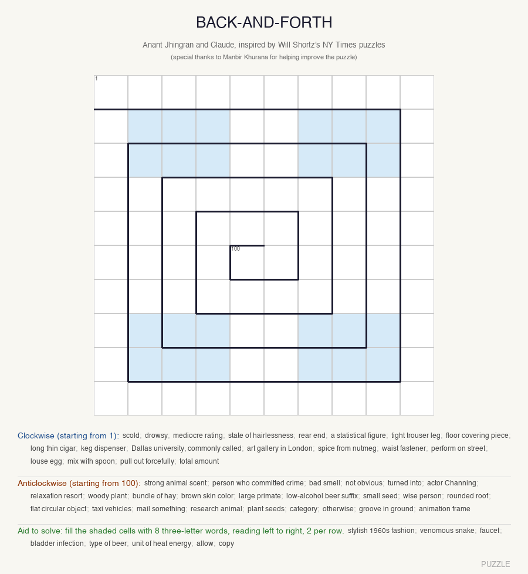
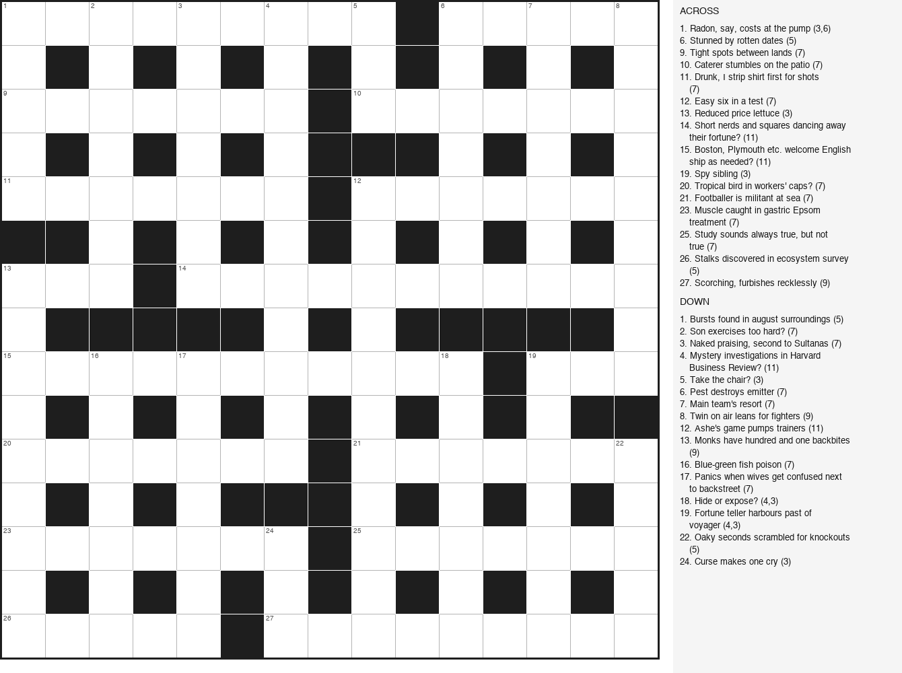
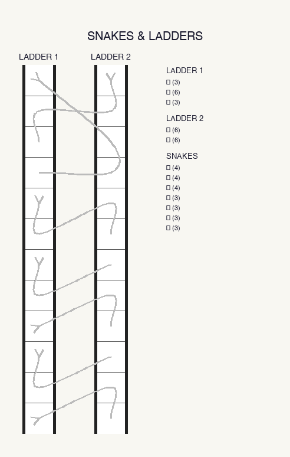
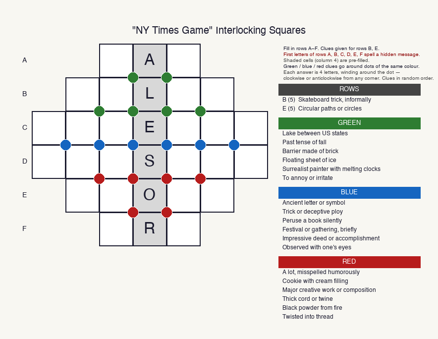

# Word Puzzle Generator

A Python toolkit for generating, filling, and cluing word puzzles. Four puzzle types, each with its own generator and worked example.

---

## Puzzle types

### Back-and-Forth

A string of letters that can be cut two different ways — each cut reading left-to-right and right-to-left yields a valid word chain. The puzzle presents only the letter string; solvers must find both cuts.



→ [`back_and_forth/`](back_and_forth/README.md)

---

### British Cryptic Crossword

A 15×15 British cryptic crossword — grid generator, word filler, and clue-writing tools. Clues follow the British cryptic convention: every clue has a definition and a wordplay component. Best written collaboratively with Claude.



→ [`cryptic/`](cryptic/README.md)

---

### Snakes & Ladders

Two word "ladders" interlocked so that zig-zag "snakes" across them also form valid words. The puzzle hides all word boundaries; solvers must identify the cuts.



→ [`snakes_ladders/`](snakes_ladders/README.md)

---

### Interlocking Squares

A diamond-shaped grid where every row reads as a word and every 2×2 corner also reads as a word (clockwise or counterclockwise). The puzzle reveals row lengths but hides the letters.



→ [`interlocking/`](interlocking/README.md)

---

## Requirements

```bash
pip install Pillow
pip install anthropic   # only for Claude-assisted clue generation
export ANTHROPIC_API_KEY=...
```

Python 3.9+. The shared word list (`wordlist.dict`) is downloaded automatically on first run.

---

## Wordlist

Shared across all puzzle types. See [ACKNOWLEDGEMENTS.md](ACKNOWLEDGEMENTS.md) for source and credits.
