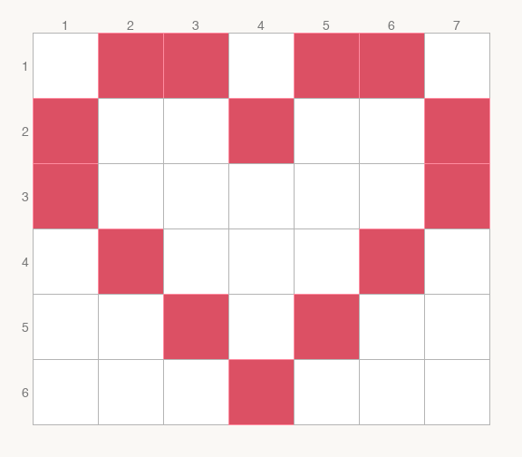

# Themed Blocks

A word-puzzle grid where a decorative shape — a heart, star, or any pixel-art outline — is drawn directly inside the playing field. The shape cells are coloured and carry no letters. Words run across every row and down every column, physically spanning those coloured cells but skipping them for letter purposes.



## How it works

Every row is one across slot, every column is one down slot. A word's **letter count equals the number of non-shape cells in that row or column**, but the word physically stretches across the full row/column, vaulting over the coloured cells. Crossing constraints apply only where a letter cell is shared between an across and a down slot.

For the built-in `heart_6x7` shape the slots are:

| Slot | Length | Notes |
|------|--------|-------|
| A1 | 3 | top row, 3 open cells |
| A2 | 4 | — |
| A3 | 5 | — |
| A4 | 5 | — |
| A5 | 5 | — |
| A6 | 6 | bottom row, 6 open cells |
| D1–D7 | 4 each | all seven columns have 4 open cells |

## Usage

```bash
# Basic — random fill
python3 themedblocks/themedblocks.py --shape heart_6x7 --seed 42

# Themed words (placed first; unique-length slots are pre-pinned)
python3 themedblocks/themedblocks.py --shape heart_6x7 --include "LOVE; STARRY" --seed 42

# Save puzzle images
python3 themedblocks/themedblocks.py --shape heart_6x7 --include "LOVE; STARRY" \
    --seed 42 --png out.png
# Produces out.png (blank) and out_answer.png (filled)
```

### Flags

| Flag | Default | Description |
|------|---------|-------------|
| `--shape` | `heart_6x7` | Shape name (see `SHAPES` dict in the script) |
| `--include` | _(none)_ | Semicolon-separated words to include, e.g. `"LOVE; STARRY"` |
| `--seed` | `42` | Random seed — change it to get a different fill |
| `--time-limit` | `30` | Solver time limit in seconds |
| `--min-score` | `50` | Minimum wordlist quality score (higher = cleaner words) |
| `--png` | _(none)_ | Output path for puzzle images |
| `--cell-px` | `72` | Cell size in pixels |

## Include words

Words passed via `--include` are placed before backtracking begins:

- If only **one slot** of the right length exists, the word is pre-pinned to it and crossing-slot domains are pruned immediately.
- If the right length matches exactly **one across slot**, the word is pre-pinned there.
- Otherwise the word is placed at the head of every matching slot's domain, so the solver tries it first.

This means `STARRY` (6 letters, only one 6-letter slot) and `LOVE` (4 letters, one across slot A2) are guaranteed to appear — the solver cannot accidentally assign those slots to other words.

## Adding new shapes

Add an entry to the `SHAPES` dict in `themedblocks.py`:

```python
SHAPES["star_7x7"] = {
    "rows": 7, "cols": 7,
    "color": (255, 200, 0),   # gold
    "skip": {
        # (row, col) cells that are coloured and carry no letters
        (0,0),(0,1),(0,5),(0,6),
        ...
    },
}
```

Any cell in `skip` is drawn in `color` and excluded from all slot cells. Every row and column with at least 3 non-skip cells becomes a slot automatically.
